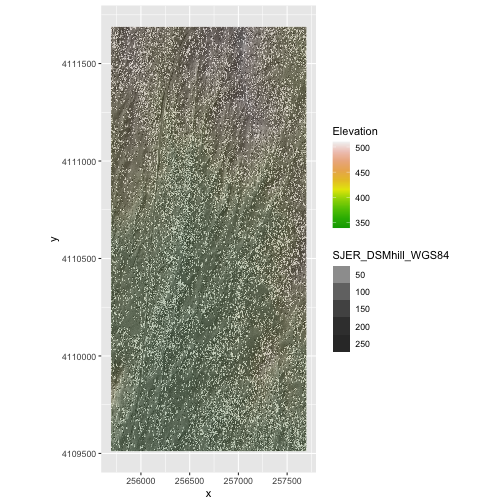

::::::::::::::::::::::::::::::::::::::: objectives

- Reproject a raster in R.

::::::::::::::::::::::::::::::::::::::::::::::::::

:::::::::::::::::::::::::::::::::::::::: questions

- How do I work with raster data sets that are in different projections?

::::::::::::::::::::::::::::::::::::::::::::::::::

Sometimes we encounter raster datasets that do not "line up" when plotted or
analyzed. Rasters that don't line up are most often in different Coordinate
Reference Systems (CRS). This episode explains how to deal with rasters in 
different, known CRSs. It will walk though reprojecting rasters in R using 
the `project()` function in the `terra` package.

Let's load the packages we'll need for this lesson: 


```r
library(terra)
```

```{.output}
terra 1.7.71
```

```r
library(ggplot2)
library(dplyr)
```

```{.output}

Attaching package: 'dplyr'
```

```{.output}
The following objects are masked from 'package:terra':

    intersect, union
```

```{.output}
The following objects are masked from 'package:stats':

    filter, lag
```

```{.output}
The following objects are masked from 'package:base':

    intersect, setdiff, setequal, union
```

## Raster Projection in R

In the previous episode, we learned how to layer a raster file on top of a 
hillshade for a nice looking basemap. In that episode, all of our data were
in the same CRS. What happens when things don't line up?

For this episode, we will be working with the Harvard Forest Digital Terrain
Model data. This differs from the surface model data we've been working with so
far in that the digital surface model (DSM) includes the tops of trees, while
the digital terrain model (DTM) shows the ground level.

Here, we will create a map of the Harvard Forest 
Digital Terrain Model (`DTM_HARV`) draped or layered on top of the hillshade 
(`DTM_hill_HARV`).
The hillshade layer maps the terrain using light and shadow to create a 
3D-looking image, based on a hypothetical illumination of the ground level.

{alt='Source: National Ecological Observatory Network (NEON).'}

First, we need to import the DTM and DTM hillshade data.


```r
DTM_HARV <- 
    rast("data/NEON-DS-Airborne-Remote-Sensing/HARV/DTM/HARV_dtmCrop.tif")

DTM_hill_HARV <- 
    rast("data/NEON-DS-Airborne-Remote-Sensing/HARV/DTM/HARV_DTMhill_WGS84.tif")
```

Next, we will convert each of these datasets to a dataframe for
plotting with `ggplot`.


```r
DTM_HARV_df <- as.data.frame(DTM_HARV, xy = TRUE)

DTM_hill_HARV_df <- as.data.frame(DTM_hill_HARV, xy = TRUE)
```

Now we can create a map of the DTM layered over the hillshade. Note that we use
`scale_fill_gradientn()` here to specify our color scale. This allows for us to
easily create a color ramp for the data we want to display.


```r
ggplot() +
     geom_raster(data = DTM_HARV_df , 
                 mapping = aes(x = x, y = y, 
                  fill = HARV_dtmCrop)) + 
     geom_raster(data = DTM_hill_HARV_df, 
                 mapping = aes(x = x, y = y, 
                   alpha = HARV_DTMhill_WGS84)) +
     scale_fill_gradientn(name = "Elevation", colors = terrain.colors(10)) + 
     coord_quickmap()
```


Our results are curious - neither the Digital Terrain Model (`DTM_HARV_df`)
nor the DTM Hillshade (`DTM_hill_HARV_df`) plotted.
Let's try to plot the DTM on its own to make sure there are data there.


```r
ggplot() +
  geom_raster(data = DTM_HARV_df,
      mapping = aes(x = x, y = y, fill = HARV_dtmCrop)) +
  scale_fill_gradientn(name = "Elevation", colors = terrain.colors(10)) + 
  coord_quickmap()
```


Our DTM seems to contain data and plots just fine.

Next we plot the DTM Hillshade on its own to see whether everything is OK.


```r
ggplot() + 
  geom_raster(data = DTM_hill_HARV_df,
              mapping = aes(x = x, y = y,
                            alpha = HARV_DTMhill_WGS84)) + 
  coord_quickmap()
```


If we look at the axes, we can see that the projections of the two rasters are 
different.
When this is the case, `ggplot` won't render the image. It won't even throw an 
error message to tell you something has gone wrong. We can look at Coordinate 
Reference Systems (CRSs) of the DTM and the hillshade data to see how they 
differ.

:::::::::::::::::::::::::::::::::::::::  challenge

## Exercise

View the CRS for each of these two datasets. What projection
does each use?

:::::::::::::::  solution

## Solution


```r
# view crs for DTM
crs(DTM_HARV, parse = TRUE)
```

```{.output}
 [1] "PROJCRS[\"WGS 84 / UTM zone 18N\","                                                                                                                                                                                                                                             
 [2] "    BASEGEOGCRS[\"WGS 84\","                                                                                                                                                                                                                                                    
 [3] "        DATUM[\"World Geodetic System 1984\","                                                                                                                                                                                                                                  
 [4] "            ELLIPSOID[\"WGS 84\",6378137,298.257223563,"                                                                                                                                                                                                                        
 [5] "                LENGTHUNIT[\"metre\",1]]],"                                                                                                                                                                                                                                     
 [6] "        PRIMEM[\"Greenwich\",0,"                                                                                                                                                                                                                                                
 [7] "            ANGLEUNIT[\"degree\",0.0174532925199433]],"                                                                                                                                                                                                                         
 [8] "        ID[\"EPSG\",4326]],"                                                                                                                                                                                                                                                    
 [9] "    CONVERSION[\"UTM zone 18N\","                                                                                                                                                                                                                                               
[10] "        METHOD[\"Transverse Mercator\","                                                                                                                                                                                                                                        
[11] "            ID[\"EPSG\",9807]],"                                                                                                                                                                                                                                                
[12] "        PARAMETER[\"Latitude of natural origin\",0,"                                                                                                                                                                                                                            
[13] "            ANGLEUNIT[\"degree\",0.0174532925199433],"                                                                                                                                                                                                                          
[14] "            ID[\"EPSG\",8801]],"                                                                                                                                                                                                                                                
[15] "        PARAMETER[\"Longitude of natural origin\",-75,"                                                                                                                                                                                                                         
[16] "            ANGLEUNIT[\"degree\",0.0174532925199433],"                                                                                                                                                                                                                          
[17] "            ID[\"EPSG\",8802]],"                                                                                                                                                                                                                                                
[18] "        PARAMETER[\"Scale factor at natural origin\",0.9996,"                                                                                                                                                                                                                   
[19] "            SCALEUNIT[\"unity\",1],"                                                                                                                                                                                                                                            
[20] "            ID[\"EPSG\",8805]],"                                                                                                                                                                                                                                                
[21] "        PARAMETER[\"False easting\",500000,"                                                                                                                                                                                                                                    
[22] "            LENGTHUNIT[\"metre\",1],"                                                                                                                                                                                                                                           
[23] "            ID[\"EPSG\",8806]],"                                                                                                                                                                                                                                                
[24] "        PARAMETER[\"False northing\",0,"                                                                                                                                                                                                                                        
[25] "            LENGTHUNIT[\"metre\",1],"                                                                                                                                                                                                                                           
[26] "            ID[\"EPSG\",8807]]],"                                                                                                                                                                                                                                               
[27] "    CS[Cartesian,2],"                                                                                                                                                                                                                                                           
[28] "        AXIS[\"(E)\",east,"                                                                                                                                                                                                                                                     
[29] "            ORDER[1],"                                                                                                                                                                                                                                                          
[30] "            LENGTHUNIT[\"metre\",1]],"                                                                                                                                                                                                                                          
[31] "        AXIS[\"(N)\",north,"                                                                                                                                                                                                                                                    
[32] "            ORDER[2],"                                                                                                                                                                                                                                                          
[33] "            LENGTHUNIT[\"metre\",1]],"                                                                                                                                                                                                                                          
[34] "    USAGE["                                                                                                                                                                                                                                                                     
[35] "        SCOPE[\"Engineering survey, topographic mapping.\"],"                                                                                                                                                                                                                   
[36] "        AREA[\"Between 78°W and 72°W, northern hemisphere between equator and 84°N, onshore and offshore. Bahamas. Canada - Nunavut; Ontario; Quebec. Colombia. Cuba. Ecuador. Greenland. Haiti. Jamaica. Panama. Turks and Caicos Islands. United States (USA). Venezuela.\"],"
[37] "        BBOX[0,-78,84,-72]],"                                                                                                                                                                                                                                                   
[38] "    ID[\"EPSG\",32618]]"                                                                                                                                                                                                                                                        
```

```r
# view crs for hillshade
crs(DTM_hill_HARV, parse = TRUE)
```

```{.output}
 [1] "GEOGCRS[\"WGS 84\","                                   
 [2] "    DATUM[\"World Geodetic System 1984\","             
 [3] "        ELLIPSOID[\"WGS 84\",6378137,298.257223563,"   
 [4] "            LENGTHUNIT[\"metre\",1]]],"                
 [5] "    PRIMEM[\"Greenwich\",0,"                           
 [6] "        ANGLEUNIT[\"degree\",0.0174532925199433]],"    
 [7] "    CS[ellipsoidal,2],"                                
 [8] "        AXIS[\"geodetic latitude (Lat)\",north,"       
 [9] "            ORDER[1],"                                 
[10] "            ANGLEUNIT[\"degree\",0.0174532925199433]],"
[11] "        AXIS[\"geodetic longitude (Lon)\",east,"       
[12] "            ORDER[2],"                                 
[13] "            ANGLEUNIT[\"degree\",0.0174532925199433]],"
[14] "    USAGE["                                            
[15] "        SCOPE[\"Horizontal component of 3D system.\"],"
[16] "        AREA[\"World.\"],"                             
[17] "        BBOX[-90,-180,90,180]],"                       
[18] "    ID[\"EPSG\",4326]]"                                
```

`DTM_HARV` is in the UTM projection, with units of meters.
`DTM_hill_HARV` is in
`Geographic WGS84` - which is represented by latitude and longitude values.


:::::::::::::::::::::::::

::::::::::::::::::::::::::::::::::::::::::::::::::

Because the two rasters are in different CRSs, they don't line up when plotted
in R. We need to reproject (or change the projection of) `DTM_hill_HARV` into 
the UTM CRS. Alternatively, we could reproject `DTM_HARV` into WGS84.

## Reproject Rasters

We can use the `project()` function to reproject a raster into a new CRS.
Keep in mind that reprojection only works when you first have a defined CRS
for the raster object that you want to reproject. It cannot be used if no
CRS is defined. Lucky for us, the `DTM_hill_HARV` has a defined CRS.

:::::::::::::::::::::::::::::::::::::::::  callout

## Data Tip

When we reproject a raster, we move it from one "grid" to another. Thus, we are 
modifying the data! Keep this in mind as we work with raster data.


::::::::::::::::::::::::::::::::::::::::::::::::::

To use the `project()` function, we need to define two things:

1. the object we want to reproject and
2. the CRS that we want to reproject it to.

The syntax is `project(x = RasterObject, y = crs)`

We want the CRS of our hillshade to match the `DTM_HARV` raster. One option 
would be to just use the CRS of `DTM_HARV` in the `project()` function, but
this will cause other issues later down the line because the resolutions of 
`DTM_HARV` and `DTM_hill_HARV` are different. That's okay, because we can specify
the resolution of the output file in the `project()` function using `res`. 

That's a little complicated for our needs though. In our case, the most 
effective way to reproject the dataset is to use the `DTM_HARV` layer as a
template for the reprojection. We can specify that by using the syntax
`project(x = RasterObject, y = TemplateRasterObject)`. 

Note that we are using the `project()` function on the raster object,
not the `data.frame()` we use for plotting with `ggplot`.


```r
DTM_hill_UTMZ18N_HARV <- project(x = DTM_hill_HARV,
                                 y = DTM_HARV)
```

For plotting with `ggplot()`, we will need to create a dataframe from our newly 
reprojected raster.


```r
DTM_hill_HARV_2_df <- as.data.frame(DTM_hill_UTMZ18N_HARV, xy = TRUE)
```

We can now create a plot of this data.


```r
ggplot() +
     geom_raster(data = DTM_HARV_df , 
                 mapping = aes(x = x, y = y, 
                               fill = HARV_dtmCrop)) + 
     geom_raster(data = DTM_hill_HARV_2_df, 
                 mapping = aes(x = x, y = y, 
                               alpha = HARV_DTMhill_WGS84)) +
     scale_fill_gradientn(name = "Elevation", colors = terrain.colors(10)) + 
     coord_quickmap()
```


We have now successfully draped the Digital Terrain Model on top of our
hillshade to produce a nice looking, textured map!

:::::::::::::::::::::::::::::::::::::::  challenge

## Challenge: Reproject, then Plot a Digital Terrain Model

Create a map of the
[San Joaquin Experimental Range](https://www.neonscience.org/field-sites/field-sites-map/SJER)
field site using the `SJER_DSMhill_WGS84.tif` and `SJER_dsmCrop.tif` files.

Reproject the data as necessary to make things line up!

:::::::::::::::  solution

## Answers


```r
# import DSM
DSM_SJER <- 
    rast("data/NEON-DS-Airborne-Remote-Sensing/SJER/DSM/SJER_dsmCrop.tif")
# import DSM hillshade
DSM_hill_SJER_WGS <-
    rast("data/NEON-DS-Airborne-Remote-Sensing/SJER/DSM/SJER_DSMhill_WGS84.tif")

# reproject raster
DSM_hill_UTMZ18N_SJER <- project(x = DSM_hill_SJER_WGS,
                                 y = DSM_SJER)

# convert to data.frames
DSM_SJER_df <- as.data.frame(DSM_SJER, xy = TRUE)

DSM_hill_SJER_df <- as.data.frame(DSM_hill_UTMZ18N_SJER, xy = TRUE)

ggplot() +
     geom_raster(data = DSM_hill_SJER_df, 
                 mapping = aes(x = x, y = y, 
                               alpha = SJER_DSMhill_WGS84)) +
     geom_raster(data = DSM_SJER_df, 
             mapping = aes(x = x, y = y, 
                           fill = SJER_dsmCrop,
                           alpha=0.8)) + 
     scale_fill_gradientn(name = "Elevation", colors = terrain.colors(10)) + 
     coord_quickmap()
```



:::::::::::::::::::::::::

If you completed the San Joaquin plotting challenge in the
[Plot Raster Data in R](02-raster-plot/)
episode, how does the map you just created compare to that map?

:::::::::::::::  solution

## Answers

The maps look identical. Which is what they should be as the only difference
is this one was reprojected from WGS84 to UTM prior to plotting.


:::::::::::::::::::::::::

::::::::::::::::::::::::::::::::::::::::::::::::::


:::::::::::::::::::::::::::::::::::::::: keypoints

- In order to plot two raster data sets together, they must be in the same CRS.
- Use the `project()` function to convert between CRSs.

::::::::::::::::::::::::::::::::::::::::::::::::::


