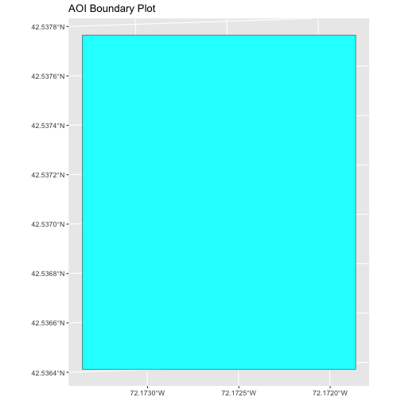

::::::::::::::::::::::::::::::::::::::: objectives

- Know the difference between point, line, and polygon vector elements.
- Load point, line, and polygon vector layers into R.
- Access the attributes of a spatial object in R.

::::::::::::::::::::::::::::::::::::::::::::::::::

:::::::::::::::::::::::::::::::::::::::: questions

- How can I distinguish between and visualize point, line and polygon vector data?

::::::::::::::::::::::::::::::::::::::::::::::::::

Starting with this episode, we will be moving from working with raster data to
working with vector data. In this episode, we will open and plot point, line
and polygon vector data loaded from ESRI's `shapefile` format into R. These data refer to
the
[NEON Harvard Forest field site](https://www.neonscience.org/field-sites/field-sites-map/HARV).

## Import Vector Data

We will use the `sf` package to work with vector data in R. 
Fun fact: `sf` stands for "simple features".

If you haven't downloaded the `sf` package yet, you can do so by going to the
Packages tab in your R console and installing a new package, or you can type
the following code into your R console: 

`install.packages("sf")`

Make sure
you have the `sf` library loaded along with the other libraries we will need.


```r
library(ggplot2)
library(dplyr)
library(sf)
```

The vector layers that we will import from ESRI's `shapefile` format are:

- A polygon vector layer representing our field site boundary,
- A line vector layer representing roads, and
- A point vector layer representing the location of the [Fisher flux tower](https://www.neonscience.org/data-collection/flux-tower-measurements)
  located at the [NEON Harvard Forest field site](https://www.neonscience.org/field-sites/field-sites-map/HARV).

The first vector layer that we will open contains the boundary of our study area
(or our Area Of Interest or AOI, hence the name `aoiBoundary`). To import
a vector layer from an ESRI `shapefile` we use the `sf` function `st_read()`. `st_read()`
requires the file path to the ESRI `shapefile`.

Let's import our AOI:


```r
aoi_boundary_HARV <- st_read(
  "data/NEON-DS-Site-Layout-Files/HARV/HarClip_UTMZ18.shp")
```

```{.output}
Reading layer `HarClip_UTMZ18' from data source 
  `/Users/echelleburns/Documents/2024-07-01-ucsb-intro-geospatial/site/built/data/NEON-DS-Site-Layout-Files/HARV/HarClip_UTMZ18.shp' 
  using driver `ESRI Shapefile'
Simple feature collection with 1 feature and 1 field
Geometry type: POLYGON
Dimension:     XY
Bounding box:  xmin: 732128 ymin: 4713209 xmax: 732251.1 ymax: 4713359
Projected CRS: WGS 84 / UTM zone 18N
```

```r
# If you are getting an error, check your file path: 
# You might need change your file path to: 
# "data/2009586/NEON-DS-Site-Layout-Files/HARV/HarClip_UTMZ18.shp"
```

## Vector Layer Metadata \& Attributes

When we import the `HarClip_UTMZ18` vector layer from an ESRI `shapefile` into R (as our
`aoi_boundary_HARV` object), the `st_read()` function automatically stores
information about the data. We are particularly interested in the geospatial
metadata, describing the format, CRS, extent, and other components of the
vector data, and the attributes which describe properties associated with each
individual vector object.

## Spatial Metadata

Key metadata for all vector layers includes:

1. **Object Type:** the class of the imported object.
2. **Coordinate Reference System (CRS):** the projection of the data.
3. **Extent:** the spatial extent (i.e. geographic area that the vector layer
   covers) of the data. Note that the spatial extent for a vector layer
   represents the combined extent for all individual objects in the vector layer.

We can view metadata of a vector layer using the `st_geometry_type()`, `st_crs()` and
`st_bbox()` functions. First, let's view the geometry type for our AOI
vector layer:


```r
st_geometry_type(aoi_boundary_HARV)
```

```{.output}
[1] POLYGON
18 Levels: GEOMETRY POINT LINESTRING POLYGON MULTIPOINT ... TRIANGLE
```

Our `aoi_boundary_HARV` is a polygon spatial object. The 18 levels shown below our
output list the possible categories of the geometry type. Now let's check what
CRS this file data is in:


```r
st_crs(aoi_boundary_HARV)
```

```{.output}
Coordinate Reference System:
  User input: WGS 84 / UTM zone 18N 
  wkt:
PROJCRS["WGS 84 / UTM zone 18N",
    BASEGEOGCRS["WGS 84",
        DATUM["World Geodetic System 1984",
            ELLIPSOID["WGS 84",6378137,298.257223563,
                LENGTHUNIT["metre",1]]],
        PRIMEM["Greenwich",0,
            ANGLEUNIT["degree",0.0174532925199433]],
        ID["EPSG",4326]],
    CONVERSION["UTM zone 18N",
        METHOD["Transverse Mercator",
            ID["EPSG",9807]],
        PARAMETER["Latitude of natural origin",0,
            ANGLEUNIT["Degree",0.0174532925199433],
            ID["EPSG",8801]],
        PARAMETER["Longitude of natural origin",-75,
            ANGLEUNIT["Degree",0.0174532925199433],
            ID["EPSG",8802]],
        PARAMETER["Scale factor at natural origin",0.9996,
            SCALEUNIT["unity",1],
            ID["EPSG",8805]],
        PARAMETER["False easting",500000,
            LENGTHUNIT["metre",1],
            ID["EPSG",8806]],
        PARAMETER["False northing",0,
            LENGTHUNIT["metre",1],
            ID["EPSG",8807]]],
    CS[Cartesian,2],
        AXIS["(E)",east,
            ORDER[1],
            LENGTHUNIT["metre",1]],
        AXIS["(N)",north,
            ORDER[2],
            LENGTHUNIT["metre",1]],
    ID["EPSG",32618]]
```

Our data in the CRS **UTM zone 18N**. The CRS is critical to interpreting the
spatial object's extent values as it specifies units. To find the extent of our AOI, we
can use the `st_bbox()` function:


```r
st_bbox(aoi_boundary_HARV)
```

```{.output}
     xmin      ymin      xmax      ymax 
 732128.0 4713208.7  732251.1 4713359.2 
```

The spatial extent of a vector layer or R spatial object represents the geographic
"edge" or location that is the furthest north, south east and west. Thus it
represents the overall geographic coverage of the spatial object. 

{alt='Extent image'}

Lastly, we can view all of the metadata and attributes for this R spatial
object by printing it to the screen:


```r
aoi_boundary_HARV
```

```{.output}
Simple feature collection with 1 feature and 1 field
Geometry type: POLYGON
Dimension:     XY
Bounding box:  xmin: 732128 ymin: 4713209 xmax: 732251.1 ymax: 4713359
Projected CRS: WGS 84 / UTM zone 18N
  id                       geometry
1  1 POLYGON ((732128 4713359, 7...
```

## Plot a vector layer

Next, let's visualize the data in our `sf` object using the `ggplot` package.
Unlike with raster data, we do not need to convert vector data to a dataframe
before plotting with `ggplot`.

We're going to customize our boundary plot by setting the color and fill
for our plot. When plotting `sf` objects with `ggplot2`, you need to use the
`coord_sf()` coordinate system.


```r
ggplot() +
  geom_sf(data = aoi_boundary_HARV, color = "black", fill = "cyan1") +
  labs(title = "AOI Boundary Plot") +
  coord_sf()
```



:::::::::::::::::::::::::::::::::::::::  challenge

## Challenge 1: Import Line and Point Vector Layers

Using the steps above, import the HARV\_roads and HARVtower\_UTM18N vector layers into
R. Call the HARV\_roads object `lines_HARV` and the HARVtower\_UTM18N
`point_HARV`.

Answer the following questions:

1. What type of R spatial object is created when you import each layer?

2. What is the CRS and extent for each object?

3. Do the files contain points, lines, or polygons?

4. How many spatial objects are in each file?

:::::::::::::::  solution

## Solution

First we import the data:


```r
lines_HARV <- st_read("data/NEON-DS-Site-Layout-Files/HARV/HARV_roads.shp")
```

```{.output}
Reading layer `HARV_roads' from data source 
  `/Users/echelleburns/Documents/2024-07-01-ucsb-intro-geospatial/site/built/data/NEON-DS-Site-Layout-Files/HARV/HARV_roads.shp' 
  using driver `ESRI Shapefile'
Simple feature collection with 13 features and 15 fields
Geometry type: MULTILINESTRING
Dimension:     XY
Bounding box:  xmin: 730741.2 ymin: 4711942 xmax: 733295.5 ymax: 4714260
Projected CRS: WGS 84 / UTM zone 18N
```

```r
# If you are getting an error, check your file path: 
# You might need change your file path to: 
# "data/2009586/NEON-DS-Site-Layout-Files/HARV/HARV_roads.shp"

point_HARV <- st_read("data/NEON-DS-Site-Layout-Files/HARV/HARVtower_UTM18N.shp")
```

```{.output}
Reading layer `HARVtower_UTM18N' from data source 
  `/Users/echelleburns/Documents/2024-07-01-ucsb-intro-geospatial/site/built/data/NEON-DS-Site-Layout-Files/HARV/HARVtower_UTM18N.shp' 
  using driver `ESRI Shapefile'
Simple feature collection with 1 feature and 14 fields
Geometry type: POINT
Dimension:     XY
Bounding box:  xmin: 732183.2 ymin: 4713265 xmax: 732183.2 ymax: 4713265
Projected CRS: WGS 84 / UTM zone 18N
```

```r
# If you are getting an error, check your file path: 
# You might need change your file path to: 
# "data/2009586/NEON-DS-Site-Layout-Files/HARV/HARVtower_UTM18N.shp"
```

Then we check its geometry type. 


```r
st_geometry_type(lines_HARV)
```

```{.output}
 [1] MULTILINESTRING MULTILINESTRING MULTILINESTRING MULTILINESTRING
 [5] MULTILINESTRING MULTILINESTRING MULTILINESTRING MULTILINESTRING
 [9] MULTILINESTRING MULTILINESTRING MULTILINESTRING MULTILINESTRING
[13] MULTILINESTRING
18 Levels: GEOMETRY POINT LINESTRING POLYGON MULTIPOINT ... TRIANGLE
```

```r
st_geometry_type(point_HARV)
```

```{.output}
[1] POINT
18 Levels: GEOMETRY POINT LINESTRING POLYGON MULTIPOINT ... TRIANGLE
```

We also check the CRS and extent of each object:


```r
st_crs(lines_HARV)
```

```{.output}
Coordinate Reference System:
  User input: WGS 84 / UTM zone 18N 
  wkt:
PROJCRS["WGS 84 / UTM zone 18N",
    BASEGEOGCRS["WGS 84",
        DATUM["World Geodetic System 1984",
            ELLIPSOID["WGS 84",6378137,298.257223563,
                LENGTHUNIT["metre",1]]],
        PRIMEM["Greenwich",0,
            ANGLEUNIT["degree",0.0174532925199433]],
        ID["EPSG",4326]],
    CONVERSION["UTM zone 18N",
        METHOD["Transverse Mercator",
            ID["EPSG",9807]],
        PARAMETER["Latitude of natural origin",0,
            ANGLEUNIT["Degree",0.0174532925199433],
            ID["EPSG",8801]],
        PARAMETER["Longitude of natural origin",-75,
            ANGLEUNIT["Degree",0.0174532925199433],
            ID["EPSG",8802]],
        PARAMETER["Scale factor at natural origin",0.9996,
            SCALEUNIT["unity",1],
            ID["EPSG",8805]],
        PARAMETER["False easting",500000,
            LENGTHUNIT["metre",1],
            ID["EPSG",8806]],
        PARAMETER["False northing",0,
            LENGTHUNIT["metre",1],
            ID["EPSG",8807]]],
    CS[Cartesian,2],
        AXIS["(E)",east,
            ORDER[1],
            LENGTHUNIT["metre",1]],
        AXIS["(N)",north,
            ORDER[2],
            LENGTHUNIT["metre",1]],
    ID["EPSG",32618]]
```

```r
st_bbox(lines_HARV)
```

```{.output}
     xmin      ymin      xmax      ymax 
 730741.2 4711942.0  733295.5 4714260.0 
```

```r
st_crs(point_HARV)
```

```{.output}
Coordinate Reference System:
  User input: WGS 84 / UTM zone 18N 
  wkt:
PROJCRS["WGS 84 / UTM zone 18N",
    BASEGEOGCRS["WGS 84",
        DATUM["World Geodetic System 1984",
            ELLIPSOID["WGS 84",6378137,298.257223563,
                LENGTHUNIT["metre",1]]],
        PRIMEM["Greenwich",0,
            ANGLEUNIT["degree",0.0174532925199433]],
        ID["EPSG",4326]],
    CONVERSION["UTM zone 18N",
        METHOD["Transverse Mercator",
            ID["EPSG",9807]],
        PARAMETER["Latitude of natural origin",0,
            ANGLEUNIT["Degree",0.0174532925199433],
            ID["EPSG",8801]],
        PARAMETER["Longitude of natural origin",-75,
            ANGLEUNIT["Degree",0.0174532925199433],
            ID["EPSG",8802]],
        PARAMETER["Scale factor at natural origin",0.9996,
            SCALEUNIT["unity",1],
            ID["EPSG",8805]],
        PARAMETER["False easting",500000,
            LENGTHUNIT["metre",1],
            ID["EPSG",8806]],
        PARAMETER["False northing",0,
            LENGTHUNIT["metre",1],
            ID["EPSG",8807]]],
    CS[Cartesian,2],
        AXIS["(E)",east,
            ORDER[1],
            LENGTHUNIT["metre",1]],
        AXIS["(N)",north,
            ORDER[2],
            LENGTHUNIT["metre",1]],
    ID["EPSG",32618]]
```

```r
st_bbox(point_HARV)
```

```{.output}
     xmin      ymin      xmax      ymax 
 732183.2 4713265.0  732183.2 4713265.0 
```

To see the number of objects in each file, we can look at the output from when
we read these objects into R. `lines_HARV` contains 13 features (all lines) and
`point_HARV` contains only one point.


:::::::::::::::::::::::::

::::::::::::::::::::::::::::::::::::::::::::::::::


:::::::::::::::::::::::::::::::::::::::: keypoints

- Metadata for vector layers include geometry type, CRS, and extent.
- Load spatial objects into R with the `st_read()` function.
- Spatial objects can be plotted directly with `ggplot` using the `geom_sf()`
  function. No need to convert to a dataframe.

::::::::::::::::::::::::::::::::::::::::::::::::::


