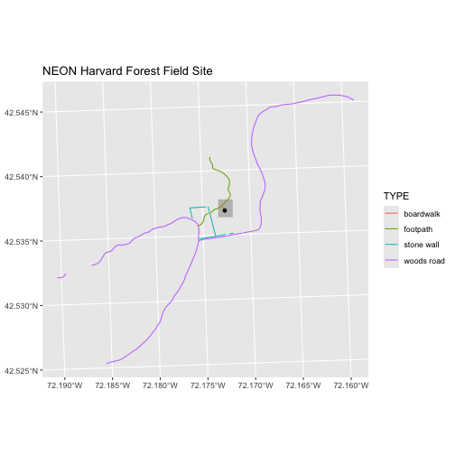
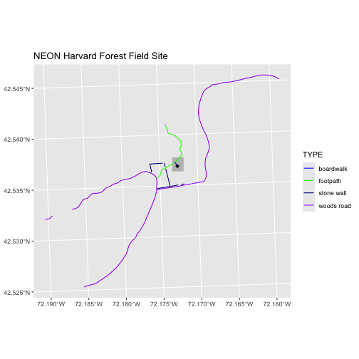
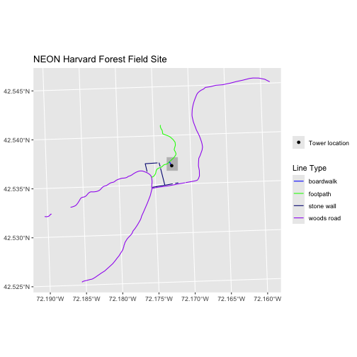
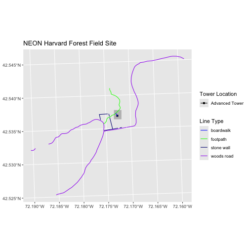
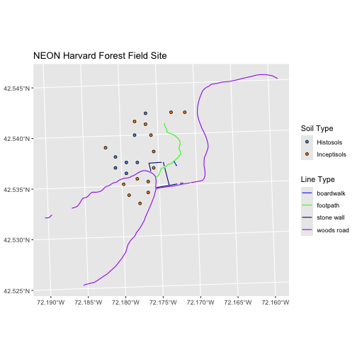
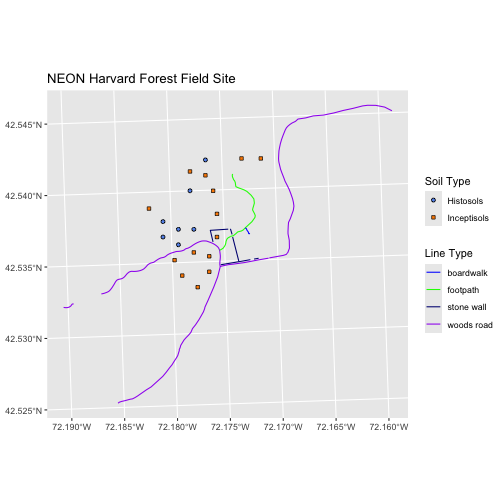
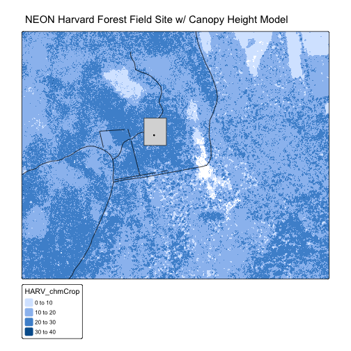

::::::::::::::::::::::::::::::::::::::: objectives

- Plot multiple vector layers in the same plot.
- Apply custom symbols to spatial objects in a plot.
- Create a multi-layered plot with raster and vector data.

::::::::::::::::::::::::::::::::::::::::::::::::::

:::::::::::::::::::::::::::::::::::::::: questions

- How can I create map compositions with custom legends using ggplot?
- How can I plot raster and vector data together?

::::::::::::::::::::::::::::::::::::::::::::::::::

This episode builds upon previous episodes
that work with vector layers in R and explore how to plot multiple
vector layers. It also covers how to plot raster and vector data together on the
same plot.

## Load the Data

To work with vector data in R, we can use the `sf` package. To work with
raster data in R, we can use the `terra` package. 
Make sure that you have these packages loaded.

We will continue to work with the three ESRI `shapefile` that we loaded in the
[Open and Plot Vector Layers in R](12-vector-open-shapefile-in-r/) episode and
the raster file we used in previous episodes.


```r
library(terra)
library(ggplot2)
library(dplyr)
library(sf)
```


```r
# Load the data
aoi_boundary_HARV <- st_read("data/NEON-DS-Site-Layout-Files/HARV/HarClip_UTMZ18.shp")

# If you are getting an error, check your file path: 
# You might need change your file path to: 
# "data/2009586/NEON-DS-Site-Layout-Files/HARV/HarClip_UTMZ18.shp"

lines_HARV <- st_read("data/NEON-DS-Site-Layout-Files/HARV/HARV_roads.shp")

# If you are getting an error, check your file path: 
# You might need change your file path to: 
# "data/2009586/NEON-DS-Site-Layout-Files/HARV/HARV_roads.shp"

point_HARV <- st_read("data/NEON-DS-Site-Layout-Files/HARV/HARVtower_UTM18N.shp")

# If you are getting an error, check your file path: 
# You might need change your file path to: 
# "data/2009586/NEON-DS-Site-Layout-Files/HARV/HARVtower_UTM18N.shp"

CHM_HARV <- rast("data/NEON-DS-Airborne-Remote-Sensing/HARV/CHM/HARV_chmCrop.tif")

# If you are getting an error, check your file path: 
# You might need change your file path to: 
# "data/2009586/NEON-DS-Airborne-Remote-Sensing/HARV/CHM/HARV_chmCrop.tif"

# Load the color palette from earlier lessons
road_colors <- c("blue", "green", "navy", "purple")
```

## Plotting Multiple Vector Layers

In the previous episode, we learned how
to plot information from a single vector layer and do some plot customization
including adding a custom legend. However, what if we want to create a more
complex plot with many vector layers and unique symbols that need to be
represented clearly in a legend?

Now, let's create a plot that combines our tower location (`point_HARV`), site
boundary (`aoi_boundary_HARV`) and roads (`lines_HARV`) spatial objects. We
will need to build a custom legend as well.

To begin, we will create a plot with the site boundary as the first layer. Then
layer the tower location and road data on top using `+`.


```r
ggplot() +
  geom_sf(data = aoi_boundary_HARV, fill = "grey", color = "grey") +
  geom_sf(data = lines_HARV, mapping = aes(color = TYPE)) +
  geom_sf(data = point_HARV) +
  labs(title = "NEON Harvard Forest Field Site") +
  coord_sf()
```



Next, let's build a custom legend using the symbology (the colors and symbols)
that we used to create the plot above. 


```r
ggplot() +
  geom_sf(data = aoi_boundary_HARV, fill = "grey", color = "grey") +
  geom_sf(data = lines_HARV, mapping = aes(color = TYPE)) +
  geom_sf(data = point_HARV) +
  scale_color_manual(values = road_colors) + 
  labs(title = "NEON Harvard Forest Field Site") +
  coord_sf()
```



What if we wanted to have a legend for the tower location (the point)? We can trick 
R into adding the legend for us, by specifying an aesthetic and value to plot within the 
`mapping = aes()` function for that layer. We've already used the color
aesthetic in the plot for the road colors, so we'll have to use another aesthetic 
type for getting the tower location to show up. In this example, let's use the 
fill aesthetic (note that there are also scales we can apply to the point shape 
and alpha [transparency]).

We can do that by changing the line of code that plots the point: 
`geom_sf(data = point_HARV, aes(fill = "Tower location"))`

This tells the plot that we want to color the "fill" of the point to be dictated
by the "Tower location" label. We can pair this with a custom fill palette
so that it's plotted the way we want. For example: 

`scale_fill_manual(values = c("Tower location" = "black"))`

This tells the plot that anything filled with the "Tower location" tag will
actually be colored black. 


```r
ggplot() +
  geom_sf(data = aoi_boundary_HARV, fill = "grey", color = "grey") +
  geom_sf(data = lines_HARV, mapping = aes(color = TYPE)) +
  geom_sf(data = point_HARV, mapping = aes(fill = "Tower location")) +
  scale_color_manual(values = road_colors) + 
  scale_fill_manual(values = c("Tower location" = "black")) + 
  labs(title = "NEON Harvard Forest Field Site") +
  coord_sf()
```


Now lets adjust the legend titles by passing a `name` to the respective `color`
and `fill` palettes. We can do this within the `color_scale_manual()` and 
`color_fill_manual()` functions, or within the `labs()` function. If we don't
want a title for either of those values, we can assign the name to NULL. 


```r
ggplot() +
  geom_sf(data = aoi_boundary_HARV, fill = "grey", color = "grey") +
  geom_sf(data = lines_HARV, mapping = aes(color = TYPE)) +
  geom_sf(data = point_HARV, mapping = aes(fill = "Tower location")) +
  scale_color_manual(values = road_colors) + 
  scale_fill_manual(values = c("Tower location" = "black")) + 
  labs(title = "NEON Harvard Forest Field Site", 
       color = "Line Type", 
       fill = NULL) +
  coord_sf()
```



Finally, it might be better if the points were symbolized as a symbol. We can
customize this using `shape` parameters in our call to `geom_sf`: 16 is a point
symbol, 15 is a box.

:::::::::::::::::::::::::::::::::::::::::  callout

## Data Tip

To view a short list of `shape` symbols,
type `?pch` into the R console.


::::::::::::::::::::::::::::::::::::::::::::::::::


```r
ggplot() +
  geom_sf(data = aoi_boundary_HARV, fill = "grey", color = "grey") +
  geom_sf(data = lines_HARV, mapping = aes(color = TYPE)) +
  geom_sf(data = point_HARV, mapping = aes(fill = "Tower location"), shape = 15) +
  scale_color_manual(values = road_colors) + 
  scale_fill_manual(values = c("Tower location" = "black")) + 
  labs(title = "NEON Harvard Forest Field Site", 
       color = "Line Type", 
       fill = NULL) +
  coord_sf()
```



:::::::::::::::::::::::::::::::::::::::  challenge

## Challenge 1: Plot Polygon by Attribute

1. Using the `NEON-DS-Site-Layout-Files/HARV/PlotLocations_HARV.shp` ESRI `shapefile`,
  create a map of study plot locations, with each point colored by the soil
  type (`soilTypeOr`). How many different soil types are there at this
  particular field site? Overlay this layer on top of the `lines_HARV` layer
  (the roads). Create a custom legend that applies line symbols to lines and
  point symbols to the points.

2. Modify the plot above. Tell R to plot each point, using a different symbol
   of `shape` value.

:::::::::::::::  solution

## Solution

First we need to read in the data and see how many unique soils are represented
in the `soilTypeOr` attribute.


```r
plot_locations <-
  st_read("data/NEON-DS-Site-Layout-Files/HARV/PlotLocations_HARV.shp")
```

```{.output}
Reading layer `PlotLocations_HARV' from data source 
  `/Users/echelleburns/Documents/2024-07-01-ucsb-intro-geospatial/site/built/data/NEON-DS-Site-Layout-Files/HARV/PlotLocations_HARV.shp' 
  using driver `ESRI Shapefile'
Simple feature collection with 21 features and 25 fields
Geometry type: POINT
Dimension:     XY
Bounding box:  xmin: 731405.3 ymin: 4712845 xmax: 732275.3 ymax: 4713846
Projected CRS: WGS 84 / UTM zone 18N
```

```r
# If you are getting an error, check your file path: 
# You might need change your file path to: 
# "data/2009586/NEON-DS-Site-Layout-Files/HARV/PlotLocations_HARV.shp"

unique(plot_locations$soilTypeOr)
```

```{.output}
[1] "Inceptisols" "Histosols"  
```

Next we can create a new color palette with one color for each soil type.


```r
blue_orange <- c("cornflowerblue", "darkorange")
```

Finally, we will create our plot.


```r
ggplot() +
  geom_sf(data = lines_HARV, mapping = aes(color = TYPE)) +
  geom_sf(data = plot_locations, mapping = aes(fill = soilTypeOr),
          shape = 21) +
  scale_color_manual(values = road_colors) +
  scale_fill_manual(values = blue_orange) +
  labs(title = "NEON Harvard Forest Field Site", 
       color = "Line Type", 
       fill = "Soil Type") +
  coord_sf()
```



If we want each soil to be shown with a different symbol, we can give multiple
values to the `scale_shape_manual()` argument. 

This get's a little tricky though, because now we have a legend for the fill color
and a legend for the shape for the soil type from the plot locations. We can
override the aesthetics of the legends so that we only display one of the legends
for the plot soil type - a legend that includes the right shape and the right
colors. We do that by removing one of the legends from the plot and altering the
legend we want to keep. 

Let's change the `scale_shape_manual()` to include the appropriate fill colors
for the points. To do this, we will use `guide = guide_legend()` within the
`scale_shape_manual()` function. We override the aesthetics by using 
`override.aes` and providing it with a list of things to override. 

Putting it all together results in a line of code that looks like this: 
`scale_shape_manual(values = c(21, 22), guide = guide_legend(override.aes = list(fill = blue_orange)))`

Here, we're specifying that we want to keep the legend for the shapes, 
but we want the legend (the guide) to look different than the default. 
We want to override the default fill values (which is black) to the colors
in the `blue_orange` vector. This will make the legend match the actual points
on the plot. 

It's a lot to take in, we know, but it might come in handy for our own research!


```r
ggplot() +
  geom_sf(data = lines_HARV, mapping = aes(color = TYPE)) +
  geom_sf(data = plot_locations, mapping = aes(fill = soilTypeOr, shape = soilTypeOr)) +
  scale_color_manual(values = road_colors) +
  scale_fill_manual(values = blue_orange, guide = "none") +
  scale_shape_manual(values = c(21, 22), 
                     guide = guide_legend(override.aes = list(fill = blue_orange))) + 
  labs(title = "NEON Harvard Forest Field Site", 
       color = "Line Type", 
       shape = "Soil Type") +
  coord_sf()
```



:::::::::::::::::::::::::

::::::::::::::::::::::::::::::::::::::::::::::::::

## Plotting Raster \& Vector Data Together

You can plot vector data layered on top of raster data using the 
`ggplot2` package or the [`tmap`](https://r-tmap.github.io/tmap/) 
package. 

We'll first go into how to do this using `ggplot`, and then we'll create
a similar plot using `tmap`. 

Together, let's create a plot that uses the NEON AOI Canopy Height Model
`data/NEON-DS-Airborne-Remote-Sensing/HARV/CHM/HARV_chmCrop.tif` (or 
`data/2009586/NEON-DS-Airborne-Remote-Sensing/HARV/CHM/HARV_chmCrop.tif` depending 
on your set up) as a base
layer. On top of the CHM, we will add the study site AOI, roads, and the tower
location. 

Remember for `ggplot` to be able to plot raster data, we first need
to convert it to a data frame. 


```r
CHM_HARV_df <- as.data.frame(CHM_HARV, xy = TRUE)
```

Now we can add it to the plot as a `geom_raster()` object: 


```r
ggplot() + 
  geom_raster(data = CHM_HARV_df, 
              mapping = aes(x = x, y = y, fill = HARV_chmCrop)) + 
  geom_sf(data = aoi_boundary_HARV, fill = "grey", color = "grey") +
  geom_sf(data = lines_HARV) +
  geom_sf(data = point_HARV) +
  labs(title = "NEON Harvard Forest Field Site w/ Canopy Height Model", 
       fill = "Canopy Height") +
  coord_sf()
```


Now we can make a similar plot using `tmap`. 

If you haven't downloaded the `tmap` package yet, you can do so by going to the
Packages tab in your R console and installing a new package, or you can type
the following code into your R console: 

`install.packages("tmap")` 

Once downloaded, remember to load `tmap` into your environment using: 


```r
library(tmap)
```

The syntax for `tmap` is to first specify a layer to plot 
and then to specify the kind of layer it is.
For example, if you wanted to plot a raster first, and then a vector 
layer on top of it, you would write something like this: 


```r
tm_shape(raster_object) + # first we specify the object to plot first
  tm_raster() + # then we specify the kind of object it is
  tm_shape(vector_object) + # then we specify the object to plot next
  tm_sf() # then we specify the kind of object it is
```

You can specify things like color and shape within the `tm_sf()` function as
`col = "black"` or `shape = 8` for example. 

Once we make our plot, we can add a title by adding `tm_title("Title here")`
at the end.


```r
# Create the plot
tm_shape(CHM_HARV) + 
  tm_raster() + 
  tm_shape(lines_HARV) + 
  tm_sf() + 
  tm_shape(aoi_boundary_HARV) + 
  tm_sf(col = "grey20") + 
  tm_shape(point_HARV) + 
  tm_sf(col = "black") + 
  tm_title("NEON Harvard Forest Field Site w/ Canopy Height Model")
```

```{.output}
SpatRaster object downsampled to 898 by 1115 cells.
```




:::::::::::::::::::::::::::::::::::::::: keypoints

- Use the `+` operator to add multiple layers to a ggplot.
- Multi-layered plots can combine raster and vector datasets. `tmap` does this best (see Challenge 2)!
- Use the `show.legend` argument to set legend symbol types.
- Use the `scale_fill_manual()` function to set legend colors.

::::::::::::::::::::::::::::::::::::::::::::::::::


