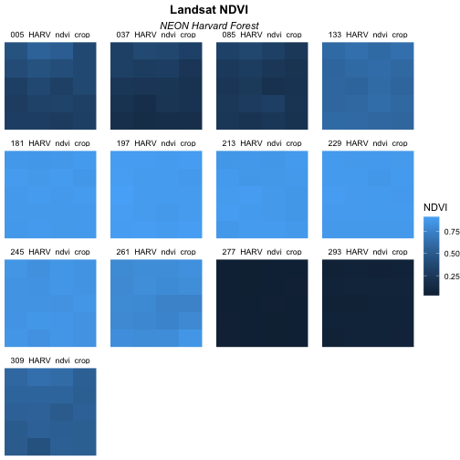
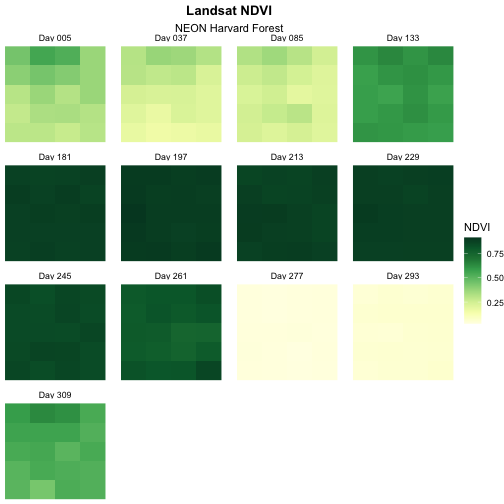
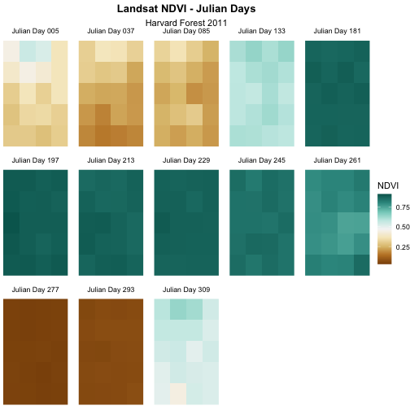

::::::::::::::::::::::::::::::::::::::: objectives

- Create a raster stack
- Assign custom names to bands in a RasterStack.
- Customize raster plots using the `ggplot2` package.

::::::::::::::::::::::::::::::::::::::::::::::::::

:::::::::::::::::::::::::::::::::::::::: questions

- How can I deal with multiple raster layers?
- How can I create a publication-quality graphic and customize plot parameters?

::::::::::::::::::::::::::::::::::::::::::::::::::


This episode covers how to customize your raster plots using the `ggplot2` 
package in R to create publication-quality plots.

First, let's load the libraries that we will need for this episode. 

We will be using the `tidyr` package in this episode, which you might 
not have used yet! 

If you haven't downloaded `tidyr` to your R yet, do so now using: 

`install.packages("tidyr")`

Once it's downloaded, load in all the packages for this episode: 


```r
library(terra)
library(ggplot2)
library(dplyr)
library(tidyr)
```

## Faceting plots

There may come a time when you will need to plot several smaller plots 
within a larger plot. The result is a plot with facets. These plots can
be useful if you have several variables that you want to show at once, or
if you're trying to look at maps over time.

We have a time series of raster data that are spread across several files.
These data show the normalized difference vegetation index (NDVI) from 
the Harvard Forest Site.
We can best visualize these data by using facets. To do this, we need to
read the data in as a "raster stack". 

First, let's get the list of all the raster files in our time series. 
We can do this using the `list.files()` function. We will only add files 
that have a .tif extension to our list. To do this, we will use the syntax 
`pattern=".tif$"`. If we specify `full.names = TRUE`, the full path for each 
file will be added to the list.

:::::::::::::::::::::::::::::::::::::::::  callout

## Data Tip

In the pattern above, the `$` character represents the end of a line. Using it 
ensures that our pattern will only match files that end in `.tif`. This pattern 
matching uses a language called "regular expressions", which is beyond the 
scope of this workshop.

- [Regular expressions tutorial](https://regexone.com/)
- [Regular expressions cheatsheet](https://github.com/rstudio/cheatsheets/blob/main/regex.pdf)
  

::::::::::::::::::::::::::::::::::::::::::::::::::


```r
NDVI_HARV_path <- "data/NEON-DS-Landsat-NDVI/HARV/2011/NDVI"

all_NDVI_HARV <- list.files(NDVI_HARV_path,
                            full.names = TRUE,
                            pattern = ".tif$")
```

It's a good idea to look at the file names that matched our search to make sure 
they meet our expectations.


```r
all_NDVI_HARV
```

```{.output}
 [1] "data/NEON-DS-Landsat-NDVI/HARV/2011/NDVI/005_HARV_ndvi_crop.tif"
 [2] "data/NEON-DS-Landsat-NDVI/HARV/2011/NDVI/037_HARV_ndvi_crop.tif"
 [3] "data/NEON-DS-Landsat-NDVI/HARV/2011/NDVI/085_HARV_ndvi_crop.tif"
 [4] "data/NEON-DS-Landsat-NDVI/HARV/2011/NDVI/133_HARV_ndvi_crop.tif"
 [5] "data/NEON-DS-Landsat-NDVI/HARV/2011/NDVI/181_HARV_ndvi_crop.tif"
 [6] "data/NEON-DS-Landsat-NDVI/HARV/2011/NDVI/197_HARV_ndvi_crop.tif"
 [7] "data/NEON-DS-Landsat-NDVI/HARV/2011/NDVI/213_HARV_ndvi_crop.tif"
 [8] "data/NEON-DS-Landsat-NDVI/HARV/2011/NDVI/229_HARV_ndvi_crop.tif"
 [9] "data/NEON-DS-Landsat-NDVI/HARV/2011/NDVI/245_HARV_ndvi_crop.tif"
[10] "data/NEON-DS-Landsat-NDVI/HARV/2011/NDVI/261_HARV_ndvi_crop.tif"
[11] "data/NEON-DS-Landsat-NDVI/HARV/2011/NDVI/277_HARV_ndvi_crop.tif"
[12] "data/NEON-DS-Landsat-NDVI/HARV/2011/NDVI/293_HARV_ndvi_crop.tif"
[13] "data/NEON-DS-Landsat-NDVI/HARV/2011/NDVI/309_HARV_ndvi_crop.tif"
```

Now we have a list of all GeoTIFF files in the NDVI directory for Harvard
Forest. The number at the start of the filenames represents the julilan day. 
Next, we will create a stack of rasters from this list using the 
`rast()` function. This is the same function we use to read in any raster file.


```r
NDVI_HARV_stack <- rast(all_NDVI_HARV)
NDVI_HARV_stack
```

```{.output}
class       : SpatRaster 
dimensions  : 5, 4, 13  (nrow, ncol, nlyr)
resolution  : 30, 30  (x, y)
extent      : 239415, 239535, 4714215, 4714365  (xmin, xmax, ymin, ymax)
coord. ref. : UTM Zone 19, Northern Hemisphere 
sources     : 005_HARV_ndvi_crop.tif  
              037_HARV_ndvi_crop.tif  
              085_HARV_ndvi_crop.tif  
              ... and 10 more source(s)
names       : 005_H~_crop, 037_H~_crop, 085_H~_crop, 133_H~_crop, 181_H~_crop, 197_H~_crop, ... 
min values  :        2732,        1534,        1917,        5669,        8685,        8768, ... 
max values  :        5545,        3736,        3600,        6394,        8903,        9140, ... 
```

We can see from looking that the data that we will need to scale the values. 
NDVI data should be a value between 0 and 1 (and it's currently a value between 0 and 10,000!): 


```r
NDVI_HARV_stack <- NDVI_HARV_stack/10000
```

Once we have created our RasterStack, we can visualize our data. We can use the 
`ggplot()` command to create a multi-panelled plot showing each band in our 
RasterStack. First we need to create a data frame object. Because there are 
multiple columns in our data that are not variables, we will tidy (or "pivot") 
the data so that we have a single column with the NDVI observations. We will 
use the function `pivot_longer()` from the `tidyr` package to do this. Since
there are so many columns with relevant data, instead of specifying the columns
we want to pivot, we can specify the columns we *don't* want to pivot instead. 
We do this by specifying `cols = -(x:y)`: 


```r
NDVI_HARV_stack_df <- as.data.frame(NDVI_HARV_stack, xy = TRUE) %>%
    pivot_longer(cols = -(x:y), names_to = "variable", values_to = "value")
```

Now we can plot our data using `ggplot()`. We want to create a separate panel 
for each time point in our time series, so we will use the `facet_wrap()` 
function to create a multi-paneled plot by the `variable` column:


```r
ggplot() +
  geom_raster(data = NDVI_HARV_stack_df, 
              mapping = aes(x = x, y = y, fill = value)) +
  facet_wrap(~variable)
```


Although this plot is informative, it isn't something we would expect to see in 
a journal publication. The x and y-axis labels aren't informative. There is a 
lot of unnecessary gray background and the titles of each panel don't clearly 
state that the number refers to the Julian day the data was collected. In this
episode, we will customize this plot above to produce a publication quality 
graphic. We will go through these steps iteratively. When we're done, we will 
have created the plot shown below.


## Adjust the Plot Theme

The first thing we will do to our plot remove the x and y-axis labels and axis 
ticks, as these are unnecessary and make our plot look messy. We can do this by 
using a pre-set `ggplot` theme that simplifies all plot parameters. We will add
the function `theme_void()` to tell `ggplot` that we want to use this theme.


```r
ggplot() +
  geom_raster(data = NDVI_HARV_stack_df, 
              mapping = aes(x = x, y = y, fill = value)) +
  facet_wrap(~variable) +
  labs(title = "Landsat NDVI", 
       subtitle = "NEON Harvard Forest", 
       fill = "NDVI") + 
  theme_void()
```


Next we will center our plot title and subtitle. We need to do this **after** 
the `theme_void()` layer, because R interprets the `ggplot` layers in order. If 
we first tell R to center our plot title, and then set the theme to `void`, any 
adjustments we've made to the plot theme will be over-written by the 
`theme_void()` function. So first we make the theme `void` and then we center 
the title. We center both the title and subtitle by using the `theme()` 
function and setting the `hjust` parameter to 0.5. The `hjust` parameter stands 
for "horizontal justification" and takes any value between 0 and 1. A setting 
of 0 indicates left justification and a setting of 1 indicates right 
justification. We can also update the "face" of the font, to be bold or italics, 
or bold and italics. To do this, we would adjust the `face` parameter. 


```r
ggplot() +
  geom_raster(data = NDVI_HARV_stack_df, 
              mapping = aes(x = x, y = y, fill = value)) +
  facet_wrap(~variable) +
  labs(title = "Landsat NDVI", 
       subtitle = "NEON Harvard Forest", 
       fill = "NDVI") + 
  theme_void() + 
  theme(plot.title = element_text(hjust = 0.5, face = "bold"),
        plot.subtitle = element_text(hjust = 0.5))
```


:::::::::::::::::::::::::::::::::::::::  challenge

## Challenge 1

Change the plot title (but not the subtitle) to bold font. You can (and 
should!) use the help menu in RStudio or any internet resources to figure out 
how to change this setting.

*Hint*: Use `?element_text()` to pull up the help file and see how you might be 
able to change the appearance of text in the `theme()` function.

:::::::::::::::  solution

## Solution

Learners can find this information in the help files for the `theme()`
function. The parameter to set is called `face`.


```r
ggplot() +
  geom_raster(data = NDVI_HARV_stack_df, 
              mapping = aes(x = x, y = y, fill = value)) +
  facet_wrap(~variable) +
  labs(title = "Landsat NDVI", 
       subtitle = "NEON Harvard Forest", 
       fill = "NDVI") + 
  theme_void() + 
  theme(plot.title = element_text(hjust = 0.5, face = "bold"),
        plot.subtitle = element_text(hjust = 0.5))
```



:::::::::::::::::::::::::

::::::::::::::::::::::::::::::::::::::::::::::::::

## Adjust the Color Ramp

Next, let's adjust the color ramp used to render the rasters. First, we can
change the blue color ramp to a green one that is more visually suited to our
NDVI (greenness) data using the `colorRampPalette()` function in combination
with `colorBrewer` which requires loading the `RColorBrewer` library. 

If you don't have the `RColorBrewer` library yet, install it using: 

`install.packages("RColorBrewer")`

Now we need to create a set of colors to use. 

We can view the palettes available in `RColorBrewer`: 


```r
display.brewer.all()
```


We will select a set of nine 
colors from the "YlGn" (yellow-green) color palette. This returns a set of hex 
color codes:


```r
library(RColorBrewer)
brewer.pal(9, "YlGn")
```

```{.output}
[1] "#FFFFE5" "#F7FCB9" "#D9F0A3" "#ADDD8E" "#78C679" "#41AB5D" "#238443"
[8] "#006837" "#004529"
```

Then we will pass those color codes to the `colorRampPalette` function, which
will interpolate from those colors a more nuanced color range.


```r
green_colors <- brewer.pal(9, "YlGn") %>%
  colorRampPalette()
```

We can tell the `colorRampPalette()` function how many discrete colors within 
this color range to create. In our case, we will use 20 colors when we plot our 
graphic. We can specify this in the `scale_fill_gradientn()` function.


```r
ggplot() +
  geom_raster(data = NDVI_HARV_stack_df, 
              mapping = aes(x = x, y = y, fill = value)) +
  facet_wrap(~variable) +
  scale_fill_gradientn(colours = green_colors(20)) + 
  labs(title = "Landsat NDVI", 
       subtitle = "NEON Harvard Forest", 
       fill = "NDVI") + 
  theme_void() + 
  theme(plot.title = element_text(hjust = 0.5, face = "bold"), 
        plot.subtitle = element_text(hjust = 0.5)) 
```


The yellow to green color ramp visually represents NDVI well given it's a
measure of greenness. Someone looking at the plot can quickly understand that
pixels that are more green have a higher NDVI value.

:::::::::::::::::::::::::::::::::::::::::  callout

## Data Tip

For all of the `brewer.pal` ramp names see the 
[brewerpal page](https://www.datavis.ca/sasmac/brewerpal.html).


::::::::::::::::::::::::::::::::::::::::::::::::::

:::::::::::::::::::::::::::::::::::::::::  callout

## Data Tip

Cynthia Brewer, the creator of ColorBrewer, offers an online tool to help 
choose suitable color ramps, or to create your own. 
[ColorBrewer 2.0; Color Advise for Cartography](https://colorbrewer2.org/)


::::::::::::::::::::::::::::::::::::::::::::::::::

## Refine Plot \& Tile Labels

Next, let's label each panel in our plot with the Julian day that the raster 
data for that panel was collected. The current names come from the band "layer 
names" stored in the `RasterStack` and the first part of each name is the 
Julian day.

To create a more meaningful label we can remove the pieces of the label we
don't want and replace it with something we do by 
using the `gsub()` function in R. The syntax is as follows:
`gsub("StringToReplace", "TextToReplaceIt", object)`.

First let's remove "\_HARV\_NDVI\_crop" from each label to make the labels
shorter and remove repetition. To illustrate how this works, we will first
look at the names for our `NDVI_HARV_stack_df` object in the `variable`
column:


```r
unique(NDVI_HARV_stack_df$variable)
```

```{.output}
 [1] "005_HARV_ndvi_crop" "037_HARV_ndvi_crop" "085_HARV_ndvi_crop"
 [4] "133_HARV_ndvi_crop" "181_HARV_ndvi_crop" "197_HARV_ndvi_crop"
 [7] "213_HARV_ndvi_crop" "229_HARV_ndvi_crop" "245_HARV_ndvi_crop"
[10] "261_HARV_ndvi_crop" "277_HARV_ndvi_crop" "293_HARV_ndvi_crop"
[13] "309_HARV_ndvi_crop"
```

Now we will use the `gsub()` function to find the character string
"\_HARV\_ndvi\_crop" and replace it with a blank string (""). We will assign 
this output to a new column (`panel_name`) using the `mutate()` function
and look at that column to
sure our code is doing what we want it to.


```r
NDVI_HARV_stack_df <- NDVI_HARV_stack_df %>% 
  mutate(panel_name = gsub("_HARV_ndvi_crop", "", variable))

unique(NDVI_HARV_stack_df$panel_name)
```

```{.output}
 [1] "005" "037" "085" "133" "181" "197" "213" "229" "245" "261" "277" "293"
[13] "309"
```

So far so good. Now let's use the `paste()` function to add the word "Day" in 
front of each of those numbers: 


```r
NDVI_HARV_stack_df <- NDVI_HARV_stack_df %>% 
  mutate(panel_name = paste("Day", panel_name))

unique(NDVI_HARV_stack_df$panel_name)
```

```{.output}
 [1] "Day 005" "Day 037" "Day 085" "Day 133" "Day 181" "Day 197" "Day 213"
 [8] "Day 229" "Day 245" "Day 261" "Day 277" "Day 293" "Day 309"
```

Our labels look good now. Let's render our plot again. This time, we'll facet
by the `panel_name` column. 


```r
ggplot() +
  geom_raster(data = NDVI_HARV_stack_df, 
              mapping = aes(x = x, y = y, fill = value)) +
  facet_wrap(~panel_name) +
  scale_fill_gradientn(colours = green_colors(20)) + 
  labs(title = "Landsat NDVI", 
       subtitle = "NEON Harvard Forest") + 
  theme_void() + 
  theme(plot.title = element_text(hjust = 0.5, face = "bold"), 
        plot.subtitle = element_text(hjust = 0.5)) 
```



## Change Layout of Panels

We can adjust the columns of our plot by setting the number of columns `ncol`
and the number of rows `nrow` in `facet_wrap`. Let's make our plot so that it 
has a width of five panels.


```r
ggplot() +
  geom_raster(data = NDVI_HARV_stack_df, 
              mapping = aes(x = x, y = y, fill = value)) +
  facet_wrap(~panel_name, ncol = 5) +
  scale_fill_gradientn(colours = green_colors(20)) + 
  labs(title = "Landsat NDVI", 
       subtitle = "NEON Harvard Forest") + 
  theme_void() + 
  theme(plot.title = element_text(hjust = 0.5, face = "bold"), 
        plot.subtitle = element_text(hjust = 0.5))
```


Now we have a beautiful, publication quality plot!

We can save this plot using the `ggsave()` function. Remember that by default
R will save the last rendered plot. We can specify the height, width, and dpi 
for the figure when we save it. This makes it super easy to meet your 
target journal's figure formatting requirements.


```r
ggsave(filename = "figures/time_series_NDVI.png", 
       height = 5, width = 5, dpi = 600)
```


:::::::::::::::::::::::::::::::::::::::  challenge

## Challenge 2: Divergent Color Ramps

When we used the `paste()` function to modify the tile labels we replaced the 
beginning of each tile title with "Day". A more descriptive name could be 
"Julian Day". Update the plot above with the following changes:

1. Label each tile "Julian Day" with the julian day value following.
2. Change the color ramp to a divergent brown to green color ramp.

**Questions:**
Does having a divergent color ramp represent the data better than a sequential 
color ramp (like "YlGn")? Can you think of other data sets where a divergent 
color ramp may be best?

:::::::::::::::  solution

## Solution


```r
NDVI_HARV_stack_df <- NDVI_HARV_stack_df %>% 
  mutate(panel_name = gsub("Day", "Julian Day", panel_name))

brown_green_colors <- colorRampPalette(brewer.pal(9, "BrBG"))

ggplot() +
  geom_raster(data = NDVI_HARV_stack_df, 
              mapping = aes(x = x, y = y, fill = value)) +
  facet_wrap(~panel_name, ncol = 5) +
  scale_fill_gradientn(colours = brown_green_colors(20)) + 
  labs(title = "Landsat NDVI - Julian Days", 
       subtitle = "Harvard Forest 2011", 
       fill = "NDVI") +
  theme_void() +
  theme(plot.title = element_text(hjust = 0.5, face = "bold"), 
        plot.subtitle = element_text(hjust = 0.5)) 
```



For NDVI data, the sequential color ramp is better than the divergent as it is
more akin to the process of greening up, which starts off at one end and just 
keeps increasing.


:::::::::::::::::::::::::

::::::::::::::::::::::::::::::::::::::::::::::::::


:::::::::::::::::::::::::::::::::::::::: keypoints

- Use the `theme_void()` function for a clean background to your plot.
- Use the `element_text()` function to adjust text size, font, and position.
- Use the `brewer.pal()` function to create a custom color palette.
- Use the `gsub()` function to do pattern matching and replacement in text 
and the `paste()` function to add to your current text.

::::::::::::::::::::::::::::::::::::::::::::::::::


